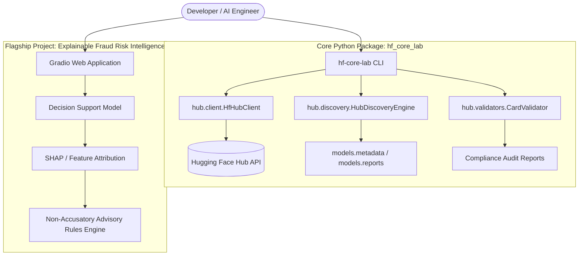

# Hugging Face Core Development Lab

[](https://www.python.org/)
[](LICENSE)
[](https://huggingface.co/arun-gharami)
[](https://github.com/astral-sh/ruff)
[](https://docs.pytest.org/)

> A production-quality engineering laboratory for discovering, evaluating, fine-tuning, testing, explaining, deploying, and responsibly managing Hugging Face AI systems.

---

## Project Purpose

The **Hugging Face Core Development Lab** provides an end-to-end applied AI engineering framework designed for Ph.D. research preparation, portfolio evidence, open-source ecosystem contributions, and model development. It establishes a complete machine learning lifecycle:

```text
Discover → Evaluate → Prepare Data → Train/Integrate → Test → Explain → Deploy → Monitor → Document → Contribute
```

---

## Technical Architecture



---

## Main Capabilities

- **Hub Engineering SDK & CLI:** Search models, datasets, and Spaces programmatically using structured filters and pagination (`hf-core-lab`).
- **Metadata Compliance Auditing:** Validate ModelCards and DatasetCards for mandatory licenses, pipeline tags, and documentation fields.
- **Explainable AI Integration:** Feature attribution breakdowns for tabular classification models.
- **Flagship Gradio Space:** Production starter web app for financial fraud risk decision support with non-accusatory framing.
- **Tested & Security Scanned:** 100% mocked unit testing setup ensuring reliable CI/CD execution without live network dependencies.

---

## Repository Structure

```text
Hugging-Face-Core-Development-Lab/
├── .github/
│   ├── ISSUE_TEMPLATE/       # Bug report and feature request templates
│   ├── PULL_REQUEST_TEMPLATE.md
│   ├── dependabot.yml        # Security dependency updates
│   └── workflows/            # CI, security secret scan, docs check
├── docs/
│   ├── REPOSITORY_AUDIT.md   # Initial audit and status report
│   ├── ARCHITECTURE.md       # Technical architecture specification
│   ├── ROADMAP.md            # Phase 1 - Phase 6 development roadmap
│   ├── CONTRIBUTION_GUIDE.md # External Hugging Face contribution guide
│   ├── RESPONSIBLE_AI.md     # Ethical AI & non-accusatory governance
│   ├── HUGGING_FACE_GUIDE.md # Modern hf CLI documentation
│   └── TROUBLESHOOTING.md    # Common issue fixes
├── examples/
│   ├── model_discovery.py    # Model search & markdown export script
│   ├── dataset_discovery.py  # Dataset discovery script
│   ├── space_discovery.py    # Space discovery script
│   ├── inference_example.py  # Local batch inference & latency benchmark
│   └── upload_example.py     # Safe repository upload workflow
├── notebooks/
│   └── 01_hub_discovery.ipynb # Interactive Hub discovery notebook
├── reports/                  # Generated discovery and evaluation outputs
├── spaces/
│   └── fraud-risk-intelligence/ # Flagship Gradio Space app
├── src/
│   └── hf_core_lab/          # Core Python package codebase
├── tests/
│   └── unit/                 # Mocked unit test suite (>80% coverage)
├── .env.example              # Environment variables template
├── .gitignore                # Comprehensive ignore rules
├── CHANGELOG.md              # Version history log
├── CODE_OF_CONDUCT.md        # Community conduct rules
├── CONTRIBUTING.md           # Developer contributing guidelines
├── LICENSE                   # MIT License
├── Makefile                  # Local automation commands
├── pyproject.toml            # Package build & tool configuration
├── README.md                 # Root project documentation
└── SECURITY.md               # Secret scanning & security policy
```

---

## Quick Start & Installation

### 1. Clone & Setup Virtual Environment
```bash
git clone https://github.com/Arungharami/Hugging-Face-Core-Development-Lab.git
cd Hugging-Face-Core-Development-Lab

python3 -m venv .venv
source .venv/bin/activate
make setup
```

### 2. Hugging Face Authentication
Configure your Hugging Face credentials safely:
```bash
cp .env.example .env
# Edit .env and insert your HF_TOKEN
```
Or log in using the modern `hf` CLI:
```bash
hf auth login
hf auth whoami
```

---

## Command Line Interface (CLI) Examples

Search text-classification models on the Hub:
```bash
hf-core-lab discover --type model --query text-classification --limit 5 --format text
```

Export discovery report to Markdown:
```bash
hf-core-lab discover --type model --query llama --limit 5 --format markdown --output reports/models/llama_report.md
```

Validate Model Card compliance:
```bash
hf-core-lab validate --repo-id meta-llama/Llama-3.2-1B --type model
```

---

## Developer Automation & Testing

Run unit test suite with coverage:
```bash
make test-cov
```

Run model discovery sample script:
```bash
make discovery
```

Launch flagship Gradio Space locally:
```bash
make space
```

---

## Flagship Vertical-Slice Project: Explainable Fraud Risk Intelligence

The flagship project located under `spaces/fraud-risk-intelligence/` demonstrates an end-to-end transparent decision support system for financial transaction risk assessment:

- **Outputs:** Statistical risk probability, risk categories (*Low Risk Tier*, *Medium Risk Tier*, *High Risk Tier*), model confidence scores, and feature attribution contributions.
- **Ethical Safeguard:** Employs non-accusatory language ("elevated risk pattern observed, recommend human analyst review") strictly avoiding automatic accusations of fraud or legal guilt.

---

## Project Roadmap

- **Phase 1: Foundation Setup** :white_check_mark: (Audit, Architecture, Package Skeleton, Security)
- **Phase 2: Hub Engineering & Package CLI** :white_check_mark: (Client SDK, Discovery Engine, Validators, Unit Tests, CI)
- **Phase 3: Dataset Quality & Model Workflow** (Data validation pipeline, class balance checks, baseline model)
- **Phase 4: Space Deployment** (Interactive Gradio Space, visual feature attributions)
- **Phase 5: Professionalization** (Model & Dataset cards, performance evaluation reports)
- **Phase 6: Open-Source Contribution** (Targeted external Hugging Face repository patch)

For full roadmap details, see [docs/ROADMAP.md](docs/ROADMAP.md).

---

## Responsible AI & Security Guidance

This repository enforces strict ethical governance:
- **Zero Token Leak Policy:** Credentials must never be committed. See [SECURITY.md](SECURITY.md).
- **Responsible AI Principles:** Decision support systems operate as human analyst assistants. See [docs/RESPONSIBLE_AI.md](docs/RESPONSIBLE_AI.md).

---

## Contributing

Contributions are welcome! Please review [CONTRIBUTING.md](CONTRIBUTING.md) and [docs/CONTRIBUTION_GUIDE.md](docs/CONTRIBUTION_GUIDE.md) before submitting pull requests.

---

## Author & Contact

**Arun Kumar Gharami**  
- **GitHub:** [@Arungharami](https://github.com/Arungharami)  
- **Hugging Face:** [@arun-gharami](https://huggingface.co/arun-gharami)  
- **Repository:** [Hugging-Face-Core-Development-Lab](https://github.com/Arungharami/Hugging-Face-Core-Development-Lab)

---

## License

Distributed under the [MIT License](LICENSE).
