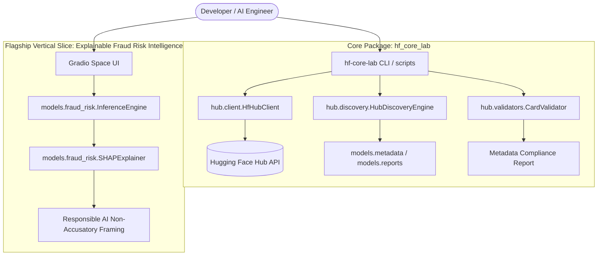

# System Architecture: Hugging Face Core Development Lab

## 1. Overview

The **Hugging Face Core Development Lab** is designed as a production-quality, modular Python architecture that provides end-to-end capabilities across the Hugging Face AI ecosystem: Hub discovery, API interaction, dataset engineering, model inference, explainability, Gradio Space deployment, and governance.

---

## 2. Layered Component Architecture



---

## 3. Package Layer Breakdown

### Layer 1: Core Utilities & Configuration (`config`, `exceptions`, `logging_config`)
- **`LabConfig`**: Centralized configuration management reading `HF_TOKEN`, `HF_USERNAME`, `ENV`, and hub parameters from environment variables with fallback defaults.
- **`HFCoreLabError`**: Base exception class extended by `HubConnectionError`, `ValidationError`, `DiscoveryError`, and `InferenceError`.
- **`logging_config`**: Standardized logging with clean console formatting.

### Layer 2: Hub Integration (`src/hf_core_lab/hub/`)
- **`HfHubClient`**: High-level thread-safe wrapper around `huggingface_hub.HfApi`. Handles authentication checks (`whoami`), error transformation, and download/upload requests.
- **`HubDiscoveryEngine`**: Queries the Hub for models, datasets, and Spaces using structured parameters (author, task, tags, sorting, limits).
- **`CardValidator`**: Inspects model card and dataset card metadata (`ModelCardData`, `DatasetCardData`) for missing tags, missing licenses, missing descriptions, and ethical disclaimers.

### Layer 3: Data & Model Serialization (`src/hf_core_lab/models/`)
- Strongly typed data models representing returned Hub resources (`ModelMetadata`, `DatasetMetadata`, `SpaceMetadata`).
- **Report Generators**: Format discovery and validation outputs into formatted JSON or Markdown summaries for automated artifact export under `reports/`.

---

## 4. Flagship Project Architecture: Explainable Fraud Risk Intelligence

```text
Synthetic / Audited Financial Dataset
                 ↓
      Data Quality & Schema Checks (src/hf_core_lab/data/)
                 ↓
     Baseline Classifier (LightGBM / XGBoost / LogisticRegression)
                 ↓
    Explainability Engine (SHAP / Feature Attribution attributions)
                 ↓
     Non-Accusatory Advisory Rules Engine (src/hf_core_lab/models/)
                 ↓
      Gradio Space Web Interface (spaces/fraud-risk-intelligence/)
```

### Risk Category Matrix

| Predicted Score ($P$) | Risk Category | Action Advisory |
| --- | --- | --- |
| $P < 0.35$ | **Low Risk** | Standard transaction processing. |
| $0.35 \le P < 0.70$ | **Medium Risk** | Secondary automated check / flagged for routine review. |
| $P \ge 0.70$ | **High Risk** | Flagged for priority manual review by an authorized analyst. |

> **Mandatory Framing:** All outputs present findings as elevated statistical risk patterns, explicitly advising human review rather than making definitive guilt claims.

---

## 5. Security & Isolation Architecture

1. **Token Protection:** Credentials are injected via runtime environment variables (`HF_TOKEN`) or loaded from local cache (`~/.cache/huggingface/token`). No secrets are written to disk.
2. **Network Decoupling in Tests:** Unit tests mock `HfApi` calls, ensuring rapid test execution without live API rate limiting or external network dependency.
