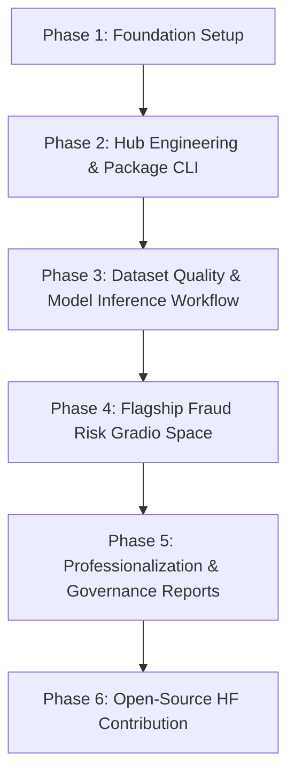

# Repository Audit Report: Hugging Face Core Development Lab

**Audit Date:** July 27, 2026  
**Auditor:** Principal AI Engineer / Lead Technical Architect  
**Repository:** [Arungharami/Hugging-Face-Core-Development-Lab](https://github.com/Arungharami/Hugging-Face-Core-Development-Lab)  
**GitHub Owner:** `Arungharami`  
**Hugging Face Account:** `arun-gharami`  

---

## 1. Executive Summary

This report documents the formal technical audit of the **Hugging Face Core Development Lab** repository. The repository was inspected across all git branches, directory structures, commit history, configuration files, workflows, and documentation.

The audit confirms that the repository is currently **freshly initialized** with zero prior commits and zero tracked files on branch `main`. While there is no legacy code or technical debt to refactor, establishing a production-quality architecture requires implementing a complete, modular, secure, and fully-tested foundation from scratch.

---

## 2. Comprehensive Status Assessment

| Domain | Status | Observations |
| --- | --- | --- |
| **Git History & Branches** | Clean Initialization | Single local branch `main` with zero commits. No legacy commits or dangling branches. |
| **Source Code & Package Structure** | Missing | No root package or modules exist. Package `src/hf_core_lab` must be built. |
| **Dependencies & Configuration** | Unconfigured | No `pyproject.toml`, `requirements.txt`, or environment templates existed. |
| **Tests & Verification** | Missing | Zero unit tests, integration tests, or mock fixtures. |
| **CI/CD & Automation** | Missing | No `.github/workflows/` configured for automated testing or security scanning. |
| **Security & Token Safety** | Clean | No hardcoded tokens, secret leaks, or compromised keys discovered in history. |
| **Documentation & Governance** | Missing | Root `README.md`, `SECURITY.md`, `LICENSE`, and `docs/` required immediate creation. |

---

## 3. Strengths, Technical Debt & Security Findings

### Strengths
1. **Clean Slate Advantage:** Absence of legacy hacks, anti-patterns, or deprecated `huggingface-cli` calls allows building a modern Python 3.11+ dataclass/Pydantic package structure.
2. **Modern Toolchain Availability:** Local environment possesses Python 3.14, standard `huggingface_hub` SDK (and modern `hf` CLI), `pytest`, `gradio`, `pandas`, `scikit-learn`, and `torch`.

### Technical Debt Risks & Mitigations
- **Network Dependency Risk:** Unmocked unit tests could fail during CI or offline execution.
  *Mitigation:* Build a robust unit test suite under `tests/unit/` using `unittest.mock` for `HfApi` and `requests`.
- **Token Vulnerability Risk:** Hardcoded HF tokens in scripts or git logs.
  *Mitigation:* Strict policy enforced in `SECURITY.md` and `.gitignore`, utilizing `.env.example` and runtime environment variable lookups (`HF_TOKEN`).

### Security & Ethical AI Findings
- **Flagship Project Domain:** The flagship project addresses financial fraud risk. Unchecked AI outputs in fraud detection can cause severe harm if framing accuses individuals of illegal acts.
  *Policy Enforced:* Non-accusatory advisories ("elevated risk pattern observed, recommend human analyst review") strictly mandated in `docs/RESPONSIBLE_AI.md` and `spaces/fraud-risk-intelligence/app.py`.

---

## 4. Recommended Architecture & Modular Design

The repository is structured into distinct, decoupled components:

```text
src/hf_core_lab/
├── __init__.py
├── cli.py                  # Command-line entrypoint (`hf-core-lab`)
├── config.py               # Settings & Environment handling
├── exceptions.py           # Structured error handling hierarchy
├── logging_config.py       # Console & structured logging setup
├── hub/                    # Hugging Face Hub SDK integrations
│   ├── client.py           # HfApi wrapper & authentication
│   ├── discovery.py        # Model, Dataset, and Space search engine
│   ├── repositories.py     # Repository operations (create, download, upload)
│   └── validators.py       # Model/Dataset card metadata verification
├── models/                 # Dataclasses & Pydantic data schemas
│   ├── metadata.py         # ModelInfo, DatasetInfo, SpaceInfo schemas
│   └── reports.py          # Markdown/JSON report generators
└── utils/                  # Reusable file and string helpers
    └── files.py
```

---

## 5. Priority-Ranked Action Plan



1. **Phase 1 (Immediate Foundation):**
   - Create baseline docs (`REPOSITORY_AUDIT.md`, `ARCHITECTURE.md`, `ROADMAP.md`, `RESPONSIBLE_AI.md`).
   - Setup project configuration (`pyproject.toml`, `.gitignore`, `Makefile`, `.env.example`).
   - Implement `src/hf_core_lab` package skeleton.
2. **Phase 2 (Hub Engineering):**
   - Build `HfHubClient`, `HubDiscoveryEngine`, and `CardValidator`.
   - Create `hf-core-lab` CLI and executable scripts in `examples/`.
   - Implement mocked pytest suite (`tests/unit/`).
3. **Phase 3 (CI/CD & Flagship Space):**
   - Configure GitHub Actions (`ci.yml`, `security.yml`, `docs-check.yml`).
   - Build Gradio starter app in `spaces/fraud-risk-intelligence/`.
   - Update root `README.md` and open draft pull request.
